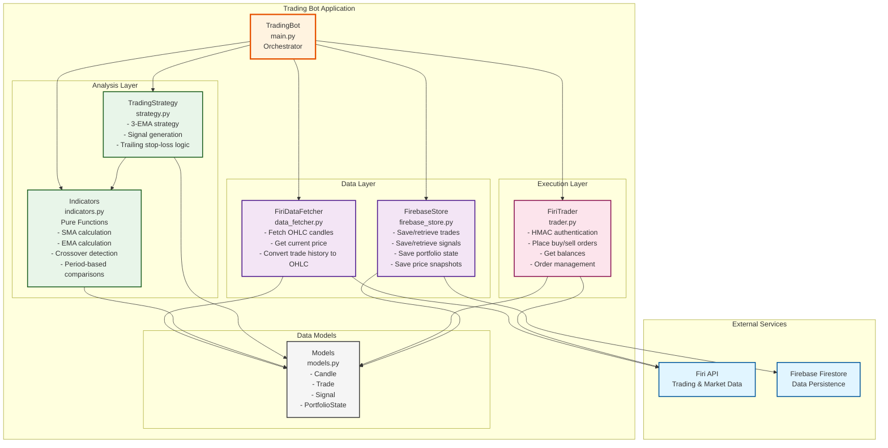
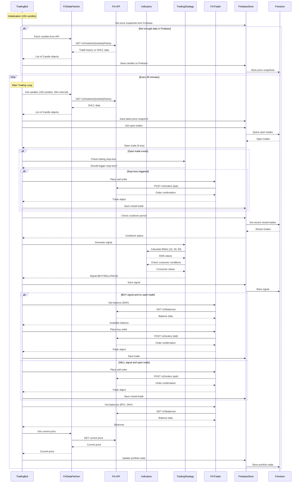
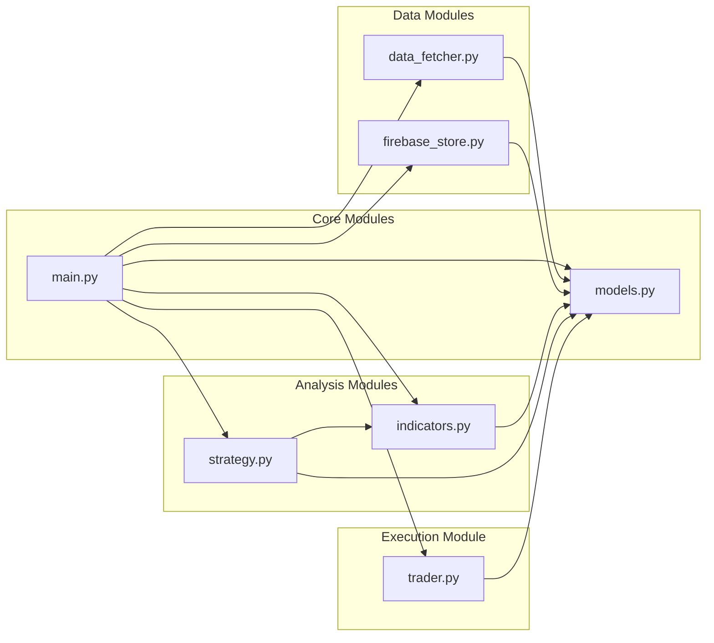
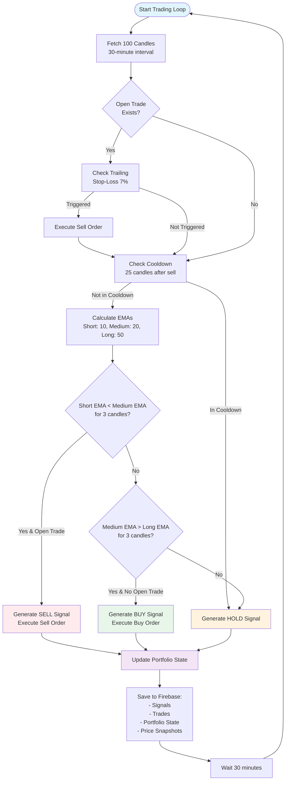
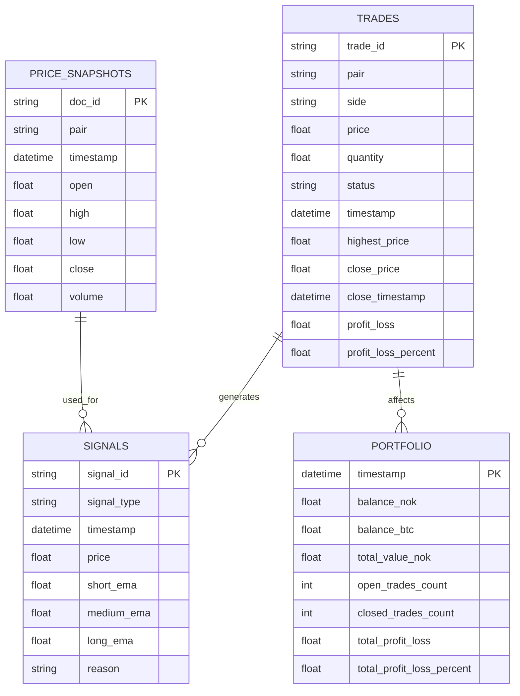

# BotAgain Trading Bot - Architecture Diagram

## System Architecture Overview

This document provides a visual representation of the BotAgain trading bot architecture.

## Component Architecture

## Data Flow Diagram

## Module Dependencies

## Trading Strategy Logic

## Data Storage Structure

## Key Architectural Principles

1. **Separation of Concerns**: Each module has a single, well-defined responsibility
2. **Pure Functions**: Indicator calculations are side-effect-free and fully testable
3. **Data Models**: Centralized data structures in `models.py` ensure consistency
4. **GRASP Principles**: Following Information Expert, Creator, and Controller patterns
5. **Modularity**: Components can be tested and modified independently
6. **External Dependencies**: Clear boundaries with Firi API and Firebase Firestore

## Component Responsibilities

| Component | Responsibility | Key Methods |
|-----------|---------------|-------------|
| **TradingBot** | Orchestrates the trading loop, coordinates all components | `run()`, `run_iteration()`, `initialize()` |
| **FiriDataFetcher** | Fetches market data from Firi API, converts to OHLC format | `get_candles()`, `get_current_price()` |
| **Indicators** | Pure functions for technical indicator calculations | `calculate_ema()`, `ema_above_ema_for_periods()` |
| **TradingStrategy** | Implements trading logic, generates signals | `generate_signal()`, `should_trailing_stop_loss()` |
| **FiriTrader** | Executes trades via Firi API with HMAC authentication | `place_buy_order()`, `place_sell_order()`, `get_balance()` |
| **FirebaseStore** | Persists all data to Firestore | `save_trade()`, `save_signal()`, `save_portfolio_state()` |
| **Models** | Data structures for trades, signals, candles, portfolio | `Trade`, `Signal`, `Candle`, `PortfolioState` |
